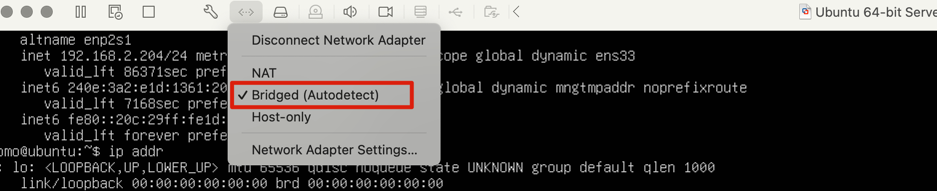

# 一、安装Ubuntu

## 1.1 虚拟机安装Ubuntu 24

参考Linux目录下安装Ubuntu文档

PS：不要用Centos7，依赖的组件比较旧，如nodejs

# 二、环境准备

## 2.1 安装nodejs

```bash
 # 下载并执行 NodeSource 提供的官方安装配置脚本，它会自动帮我们配置好软件源
 curl -fsSL https://deb.nodesource.com/setup_22.x | sudo bash -
 
 # 使用 apt 包管理器来安装 Node.js
 apt-get install -y nodejs
 
 # 安装结束后查看版本号
 node -v
```

## 2.2 设置npm数据源

```bash
 # 设置阿里云NPM数据源
 npm config set registry https://registry.npmmirror.com

 # 查看数据源
 npm config get registry
 
 # 恢复官方源
 npm config set registry https://registry.npmjs.org
```

## 2.3 防火墙配置

### 2.3.1 UFW

```bash
 # 查看 UFW 状态
 sudo ufw status

 # 开放端口（例如 8080）
 sudo ufw allow 8080

 # 重启防火墙生效
 sudo ufw reload
```

### 2.3.2 iptables

一般没启用

### 2.3.3 AppArmor

```bash
 # 禁用AppArmor
 sudo systemctl disable apparmor --now
```

## 2.3 网络模式

更改网络适配器为桥接，局域网内可以访问



# 二、安装OpenClaw

## 2.1 全局安装OpenClaw

```bash
 # 切到root用户
 su -
 输入rootmima
 
 # 全局安装，预计30分钟左右
 npm install -g openclaw@latest
 
 # 查看安装版本
 openclaw --version
```

## 2.2 配置大模型

OpenClaw 安装好之后还只是一个空壳，我们需要给它连接大模型。官方提供了一个交互式配置向导。

启动初始化向导并安装守护进程：

```bash
 openclaw onboard --install-daemon
```

openclaw onboard --install-daemon

配置选择：

- 个人电脑，权限选择：yes
- 向导模式：QuickStart
- 大模型：Moonshot AI（Kimi K2.5）-> Kimi API key（.ai），粘贴token，默认选择kimi
- 其他跳过
- Search provider：选择Kimi
- Configure skills：选择No
- Enable hooks：跳过

配置完成后，我们需要手动把网关服务跑起来。使用以下命令启动服务，并指定监听端口为 18789：

```bash
 openclaw gateway --port 18789
```

# 三、配置OpenClaw

## 3.1 修改配置

为了能在本机访问，需要对OpenClaw进行一些配置： 绑定模式、允许跨域访问等

配置修改：

- mode：默认local，保持不变
- port：端口，需要在访问
- bind：绑定模式，
    - local：默认，仅绑定到 localhost (127.0.0.1)，只能本机访问
    - lan：局域网访问，绑定到所有局域网接口，局域网内设备可以访问
    - auto：自动选择合适的绑定方式
    - custom：使用自定义绑定地址（需配合 customBindHost 参数）
    - tailnet：通过Tailscale网络提供服务

```bash
  vim ~/.openclaw/openclaw.json
```

配置项：

```json
{
  "gateway": {
    "mode": "local",
    "auth": {
      "mode": "token",
      "token": "7e400b7b6a6cdee9effbe48e0697a5240728b93b18fb54bc"
    },
    "port": 18789,
    "bind": "lan",
    "controlUi": {
      "allowInsecureAuth": true,
      "allowedOrigins": [
        "*"
      ],
      "dangerouslyDisableDeviceAuth": true
    }
  }
}

```

重启网关

```bash

systemctl --user restart openclaw-gateway

# CLI命令重启
openclaw gateway restart

# 强制重启（杀端口）
openclaw gateway --force

```

查看网关状态：

```bash

# 查看网关状态
openclaw gateway status

# 实时查看日志
openclaw logs --follow

```

## 3.2 OpenClaw默认的18789端口监听情况

查看端口18789监听情况：

```bash
 # netstat，可能没安装
 # 安装
 sudo apt update
 sudo apt install net-tools
 # 查看端口占用监听
 sudo netstat -tunlp | grep :18789
 # 输出：
 tcp 0  0 0.0.0.0:18789  0.0.0.0:*  LISTEN 7107/openclaw-gatew

 # 方式二：lsof
 sudo lsof -i:18789
 
 # 方式三：ss 命令（推荐，更现代更快）
 sudo ss -tunlp | grep :18789
 # 输出
 tcp   LISTEN 0  511 0.0.0.0:18789 0.0.0.0:*    users:(("openclaw-gatewa",pid=7107,fd=22))

```

# 访问OpenClaw

## 本机访问

http://192.168.2.204:18789/

token：7e400b7b6a6cdee9effbe48e0697a5240728b93b18fb54bc

忘记token可以通过 openclaw gateway status 查看

## 聊天

聊天不响应问题：

