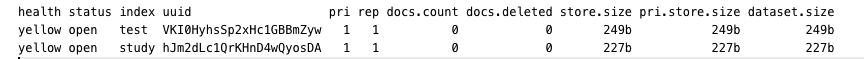

# HTTP

## 1.1 索引

### 1.1.1 查询索引

> api：
> - 查询指定索引：GET http://localhost:9200/{index_name}
> - 查询所有索引：GET http://localhost:9200/_cat/indices?v

示例：

- 查询博客索引：`GET http://localhost:9200/blog`
- 查询所有索引：`GET http://localhost:9200/_cat/indices?v`
  

### 1.1.2 创建索引

> api：PUT http://localhost:9200/{index_name}

示例：

- 创建博客索引：`PUT http://localhost:9200/blog`

### 1.1.3 删除索引

> api：DELETE http://localhost:9200/{index_name}

示例：

- 删除博客索引：`DELETE http://localhost:9200/blog`

## 1.2 映射

### 1.2.1 查询映射

> api：
> - 查询映射：GET http://localhost:9200/{index_name}/_mapping

示例：

- 查询博客映射：`GET http://localhost:9200/blog/_mapping`

### 1.2.2 创建映射

> api：
> - 创建映射：PUT http://localhost:9200/{index_name}/_mapping

请求体：

```json
{
  "properties": {
    "title": {
      "type": "text",
      "index": true
    },
    "category": {
      "type": "keyword",
      "index": true
    },
    "images": {
      "type": "text",
      "index": false
    },
    "price": {
      "type": "long",
      "index": true
    }
  }
}
```

type类型说明：

| 类型  | 关键字          | 说明                 |
|-----|--------------|--------------------|
| 字符串 | text         | 可分词，即被match全文检索    |
| 字符串 | keyword      | 不可分词，数据会作为完整字段进行匹配 |
| 数值  | long         |  |
| 数值  | integer      |  |
| 数值  | short        |  |
| 数值  | byte         |  |
| 数值  | double       |  |
| 数值  | float        |  |
| 数值  | half_float   |  |
| 数值  | scaled_float |  |
| 日期  | date         |  |
| 数组  | array        |  |
| 对象  | object       |  |

示例：

- 创建博客索引：`PUT http://localhost:9200/blog/_mapping`

```json
{
  "properties": {
    "id": {
      "type": "long",
      "index": true
    },
    "title": {
      "type": "keyword",
      "index": true
    },
    "content": {
      "type": "text",
      "index": true
    },
    "cover": {
      "type": "text",
      "index": false
    },
    "createTime": {
      "type": "date",
      "format": "yyyy-MM-dd HH:mm:ss",
      "index": true
    },
    "updateTime": {
      "type": "date",
      "format": "yyyy-MM-dd HH:mm:ss",
      "index": true
    }
  }
}
```

## 1.3 文档

### 1.3.1 查询文档

> api：
> - 查询指定文档：GET http://localhost:9200/{index_name}/_doc/{id}
> - 查询所有文档：GET http://localhost:9200/{index_name}/_search

示例：

- 查询博客：`GET http://localhost:9200/blog/_doc/1`

### 1.3.2 创建文档

> api：
> - 创建文档-随机id：POST http://localhost:9200/{index_name}/_doc

```json
{
  "title": "ES学习笔记",
  "content": "测试测试测试",
  "cover": "http://www.baidu.com",
  "createTime": "2024-07-13 10:00:00",
  "updateTime": "2024-07-13 10:00:00"
}
```

> - 创建文档-指定id：POST http://localhost:9200/{index_name}/_doc/{id}

```json
{
  "title": "ES学习笔记",
  "content": "测试测试测试",
  "cover": "http://www.baidu.com",
  "createTime": "2024-07-13 10:00:00",
  "updateTime": "2024-07-13 10:00:00"
}
```

示例：

- 查询博客映射：`GET http://localhost:9200/blog/_mapping`

### 1.3.3 更新文档

> api：
> - 更新文档-全量更新：PUT http://localhost:9200/{index_name}/_doc/{id}

请求参数：

```json
{
  "title": "ES学习笔记",
  "content": "测试测试测试",
  "cover": "http://www.baidu.com",
  "createTime": "2024-07-13 10:00:00",
  "updateTime": "2024-07-13 10:00:00"
}
```

> - 更新文档-部分更新：POST http://localhost:9200/{index_name}/_update/{id}

请求参数：

```json
{
  "doc": {
    "title": "ES学习笔记2",
    "updateTime": "2024-07-13 10:00:00"
  }
}
```

### 1.3.4 删除文档

> api：
> - 删除文档：DELETE http://localhost:9200/{index_name}/_doc/{id}

## 1.4 批处理

