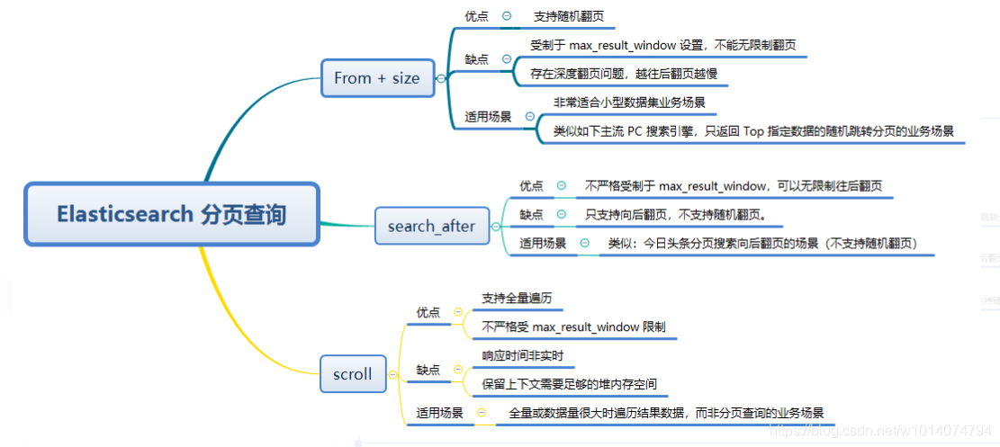

ES分页主要有以下3种方式，

| 方式           | 说明                                                            | 优点 | 缺点               |
|--------------|---------------------------------------------------------------|----|------------------|
| from+size    | 不支持深分页，默认支持搜索 index.max_result_window：10000，即from+size<=10000 |    | 不支持深分页           |
| scroll       | 适用于非实时处理大量数据                                                  |    | 存在延迟             |
| Scroll Scan  | 对比scroll性能更好，但不支持排序                                           |    | 不支持排序            |
| search_after | ES 5 新引入的一种分页查询机制                                             |    | 不支持随机分页查询，只能往下翻页 |

