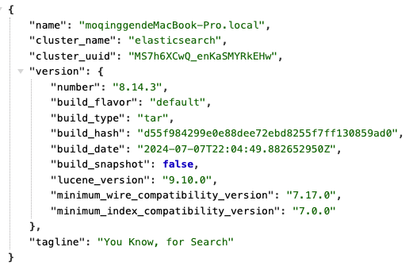
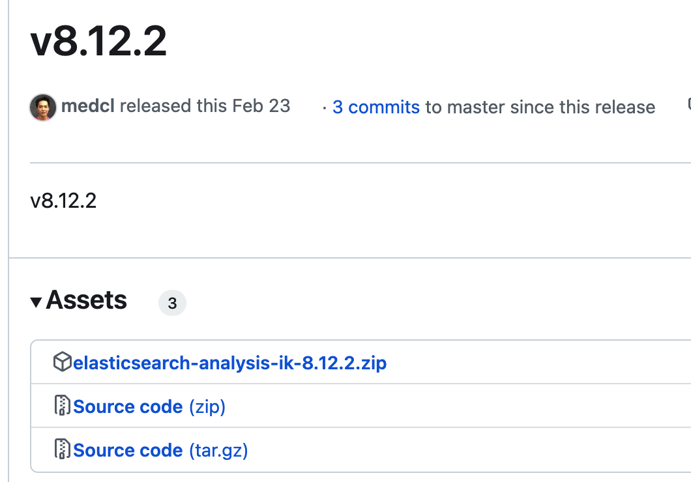

## 一、安装ES

### 1.1 单机版安装

#### 1.1.1 mac安装ES

-
官网下载es：[https://www.elastic.co/cn/downloads/past-releases#elasticsearch](https://www.elastic.co/cn/downloads/past-releases#elasticsearch)
    - 下载 elasticsearch-8.12.2版本，否则没有对应版本的ik分词器
- 解压安装
    - 解压放至 /usr/local/elasticsearch 目录下
- 修改配置文件
    - cd /usr/local/elasticsearch/elasticsearch-8.12.2/config
        - 修改 elasticsearch.yml
- 启动ES
    - cd /usr/local/elasticsearch/elasticsearch-8.12.2/bin
    - ./elasticsearch
- 访问ES：[http://localhost:9200](http://localhost:9200)



### 1.2 集群版安装

暂无

## 二、安装elasticsearch-head

### Google应用商店

搜索 `elasticsearch-head`插件，安装即可

### 手动安装插件

- 下载插件：GitHub：[xxx](xxx)
- 解压缩文件
- Chrome加载插件即可

## 三、安装Kibana

TODO

## 四、安装插件

### 4.1 ik分词器

#### 4.1.1 下载安装

- 下载：[https://github.com/infinilabs/analysis-ik](https://github.com/infinilabs/analysis-ik)
    - PS：选择8.12.2版本，下载的版本需要和ES版本一致
      
- 安装：
    - 进入ES安装目录：`cd /usr/local/elasticsearch/elasticsearch-8.12.2/plugins`
    - 新建目录：`mkdir ik`
    - 将下载好的分词器压缩包解压，解压后的文件放到ik目录下即可

#### 4.1.2 配置

#### （1）配置扩展词条

- 打开配置文件：/usr/local/elasticsearch/elasticsearch-8.12.2/plugins/ik/config/IKAnalyzer.cfg.xml
- 配置扩展词条文件

```xml

<entry key="ext_dict">ext.dic</entry>
```

- 创建`ext.dic`文件：输入自定义词条即可，每行一个

#### （2）配置停用词条

- 打开配置文件：/usr/local/elasticsearch/elasticsearch-8.12.2/plugins/ik/config/IKAnalyzer.cfg.xml
- 配置扩展词条文件

```xml

<entry key="ext_stopwords">stopwords.dic</entry>
```

- 创建`stopwords.dic`文件：输入自定义词条即可，每行一个

#### 4.1.3 使用

模式：

- ik_smart：智能切分，粗粒度
- ik_max_word：最细切分，细粒度