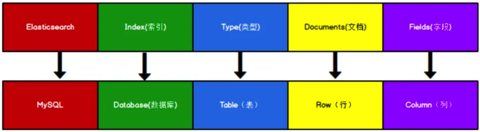

# 简介

Elasticsearch 是面向文档型数据库，一条数据在这里就是一个文档。

可以将 Elasticsearch 里存储文档数据和关系型数据库 MySQL 存储数据的概念进行一个类比。

ES 里的 Index 可以看做一个库，而 Types 相当于表，Documents 则相当于表的行。

参考下图与关系型数据库对比：

> PS：`Types`的概念已经被逐渐弱化
> - Elasticsearch 6.X 中，一个 index 下已经只能包含一个type，
> - Elasticsearch 7.X 中, Type 的概念已经被删除。