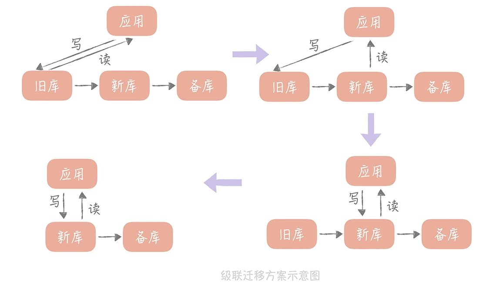

迁移过程也需要满足以下几个目标：

- 迁移应该是在线的迁移，也就是在迁移的同时还会有数据的写入；
- 数据应该保证完整性，也就是说在迁移之后需要保证新的库和旧的库的数据是一致的；
- 迁移的过程需要做到可以回滚，这样一旦迁移的过程中出现问题，可以立刻回滚到源库不会对系统的可用性造成影响。

## 迁移方案

| 迁移方案 |                                                                                                                                                                                                                                                                    |                  |
|------|--------------------------------------------------------------------------------------------------------------------------------------------------------------------------------------------------------------------------------------------------------------------|------------------|
| 双写   | 这种方案是一种比较通用的方案，无论是迁移 MySQL 中的数据还是迁移 Redis 中的数据，甚至迁移消息队列都可以使用这种方式，你在实际的工作中可以直接拿来使用。 这种方式的好处是：迁移的过程可以随时回滚，将迁移的风险降到了最低                                                                                                                                                | 时间周期比较长，应用有改造的成本 |
| 级联同步 | 这种方案的回滚方案也比较简单，可以先将读流量切换到备库再暂停应用的写入，将写流量切换到备库，这样所有的流量都切换到了备库，也就是又回到了自建机房的环境，就可以认为已经回滚了。 上面的级联迁移方案可以应用在将 MySQL 从自建机房迁移到云上的场景，也可以应用在将 Redis 从自建机房迁移到云上的场景，如果你有类似的需求可以直接拿来应用。 这种方案优势是简单易实施，在业务上基本没有改造的成本；缺点是在切写的时候需要短暂的停止写入，对于业务来说是有损的，不过如果在业务低峰期来执行切写，可以将对业务的影响降至最低。 |                  |

### 双写

步骤：

1. 从库配置：将新的库配置为源库的从库用来同步数据；如果需要将数据同步到多库多表，那么可以使用一些第三方工具获取 Binlog
   的增量日志（比如开源工具 Canal），在获取增量日志之后就可以按照分库分表的逻辑写入到新的库表中了。
2.
改造业务代码：在数据写入的时候不仅要写入旧库也要写入新库。基于性能的考虑，可以异步地写入新库，只要保证旧库写入成功即可。但是我们需要注意的是，需要将写入新库失败的数据记录在单独的日志中，这样方便后续对这些数据补写，保证新库和旧库的数据一致性。
3. 数据校验：由于数据库中数据量很大，做全量的数据校验不太现实。可以抽取部分数据，具体数据量依据总体数据量而定，只要保证这些数据是一致的就可以。
4. 读流量切换到新库：一次切换全量读流量可能会对系统产生未知的影响，所以这里最好采用灰度的方式来切换，比如开始切换 10%
   的流量，如果没有问题再切换到 50% 的流量，最后再切换到 100%。
5. 回滚：切换的过程中出现任何的问题可以将读写流量随时切换到旧库去，由于有双写的存在，可以保证回滚后业务也正常，保障系统的性能。
6. 写流量切换到新库：在观察了几天发现数据的迁移没有问题之后，就可以将数据库的双写改造成只写新库，数据的迁移也就完成了。

> ps: 其中最容易出问题的步骤就是数据校验的工作，建议在未开始迁移数据之前先写好数据校验的工具或者脚本，在测试环境上测试充分之后，再开始正式的数据迁移。

### 级联同步

比较适合数据从自建机房向云上迁移的场景。因为迁移上云最担心云上的环境和自建机房的环境不一致，会导致数据库在云上运行时因为参数配置或者硬件环境不同出现问题。

所以会在自建机房准备一个备库，在云上环境上准备一个新库，通过级联同步的方式在自建机房留下一个可回滚的数据库。

具体的步骤如下：

1. 先将新库配置为旧库的从库，用作数据同步；
2. 再将一个备库配置为新库的从库，用作数据的备份；
3. 等到三个库的写入一致后，将数据库的读流量切换到新库；
4. 然后暂停应用的写入，将业务的写入流量切换到新库（由于这里需要暂停应用的写入，所以需要安排在业务的低峰期）。

