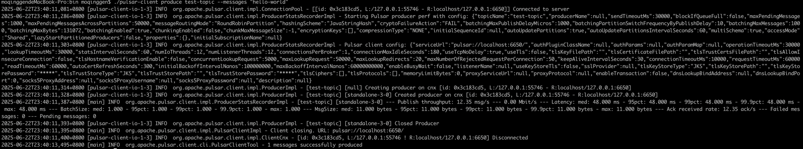
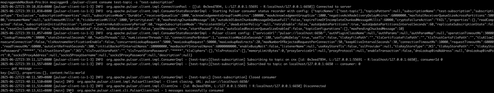

## MAC安装

下载地址：[https://pulsar.apache.org/download/](https://pulsar.apache.org/download/)
这里选择3.1.3版本，下载后找个目录解压即可。

该版本pulsar依赖JDK17，所以本地需要先安装好。

启动命令：

```bash
# 进入目录
cd /xxx/pulsar/apache-pulsar-3.1.3/bin

# 启动单机模式Pulsar，会自动启动一个zookeeper
# 控制台不报错表示启动成功
./pulsar standalone
```

测试发送消息：

```bash
# 进入目录
cd /xxx/pulsar/apache-pulsar-3.1.3/bin

# 消费者订阅: 在test-subscription 订阅中 consume 一条消息到topic:test-topic 的命令
./pulsar-client consume test-topic -s "test-subscription"

# 开启另一个终端发送数据,注意观察订阅者收到数据：content:hello-world
# 生产者发送: 向名称为 test-topic 的 topic 发送一条简单的消息 hello-world
./pulsar-client produce test-topic --messages "hello-world"
```

发送消息：


消费消息：

