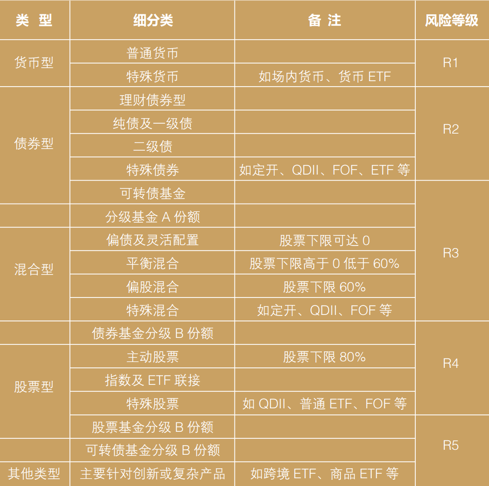
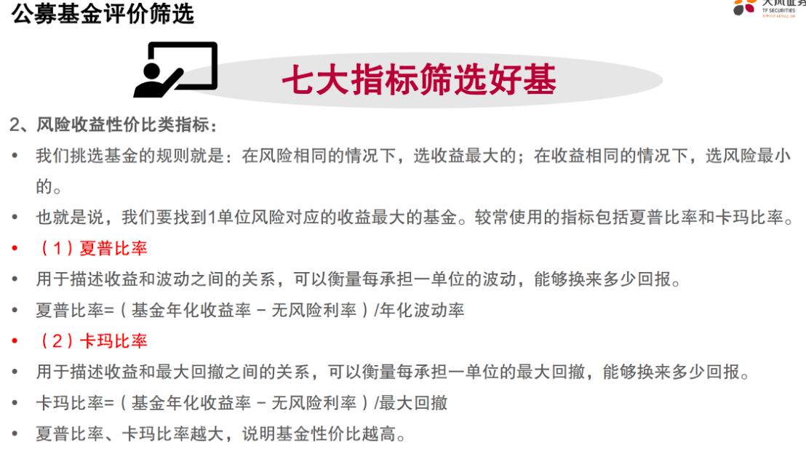

## 公募基金产品划分：

### 基金份额净值

- 基金份额净值：指基金在某一个时点上，按照公允价格计算的基金资产扣除负债后的余额除以对应的基金份额数，代表基金持有人的权益，也可以简单理解为买卖一份基金的价格
- 基金份额累计净值：基金份额净值＋基金成立后份额的累计分红金额
- 复权单位净值：复权单位 净值将分红加回单位净值，并作为再投资进行复利计算， 即假设投资者获得分红均选择红利再投资的情况下基金净值的水平。
    - 复权单位净值反映的是分红再投资的收益
    - 以某只基金为例，复权净值为 1.6742，意味着如果投资者在基金成立之初即持有基金，并且每次分红均选择红利再投资，则其总资产为当初本金的
      1.6742 倍

### 相关指标

夏普比率、卡玛比率：

## A股常见的宽基指数

| 指数             | 组成                                                                       | 特点                                                                                             | 备注 |
|----------------|--------------------------------------------------------------------------|------------------------------------------------------------------------------------------------|----|
| 上证50指数         | 挑选上交所证券市场规模大、流动性好的最具代表性的 50 只股票组成样本股                                     | 综合反映上交所证券市场最具市场影响力的一批龙头企业的整体状况                                                                 |    |
| 沪深300指数        | 沪深 300 指数以规模和流动性作为选样的两个根本标准，以大盘股为主，兼顾深沪两市上市公司整体表现                        | 深交所于 2010 年 6 月 1 日起正式编制和发布创业板指数                                                               |    |
| 创业板指数          | 由最具代表性的 100 家创业板上市企业股票组成                                                 |                                                                                                |    |
| 中证500指数        | 排除掉沪深 300 的 300 家公司，再排除最近一年日均总市值排名前 300 名的企业，在剩下的公司中，选择日均总市值排名前 500 名的企业 | 主要反映中等规模上市公司表现                                                                                 |    |
| 中证800指数        | 成份股由中证 500 和沪深 300 成份股一起构成                                               | 综合反映深沪证券市场内大中小市值公司的整体状况                                                                        |    |
| 中证1000指数       | 选择中证 800 指数样本股之外规模偏小且流动性好的 1000 只股票组成                                    | 与沪深 300 和中证500 指数形成互补。中证 1000 指数成份股的平均市值及市值中位数较中小板指、创业板指、中证 500指数相比都更小，更能综合反映深沪证券市场内小市值公司的整体状况 |    |
| 深证100指数        | 包含了深交所市场 A 股流通 市值最大、成交最活跃的 100 只成份股                                      | 中国证券市场第一只定位投资功能和代表多层次市场体系的指数，代表了深交所 A 股市场的核心优质资产                                               |    |
| 中小企业板指数        | 从深交所中小企业板上市交易的 A股中选取的，具有代表性的股票，选样指标为一段时期 ( 一般为前六个月 ) 平均流通市值的比重和平均成交金额的比重 |                                                                                                |    |
| 沪深 300 红利低波动指数 | 从沪深 300 样本股中选取 50 只流动性好、连续分红、股息率高且波动率低的股票作为指数样本股                         | 反映沪深 300样本股中股息率高且波动率低的股票整体表现                                                                   |    |

## 港股

- 恒生指数：
    - 恒生国企指数：由香港市场上市的规模较大的100家中国企业组成

## 境外

- 美股：
    - 标普500：由在美国上市的最有代表性的500家股票组成， 是美国优秀的上市公司的代表
    - 纳斯达克100：由美国纳斯达克上市的100家股票组成，是美国科技股的代表
- 伦敦金融时报100指数（或称富时100指数）：在伦敦证券交易所上市的一百家最大市值公司股票组成，该指数是英国经济的晴雨表，也是欧洲最重要的股票指数之一
- 德国DAX指数 是德国市场30家蓝筹股组成的指数，是德国最优秀企业的代表

